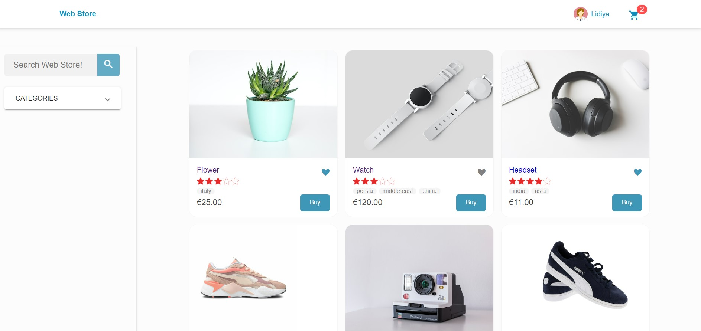
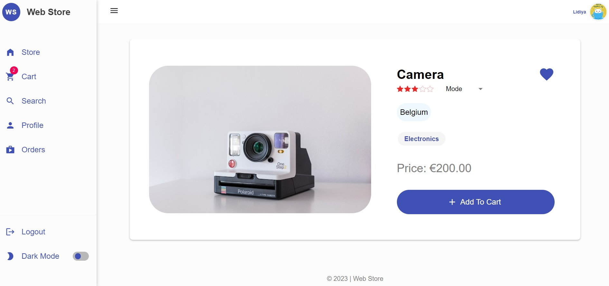
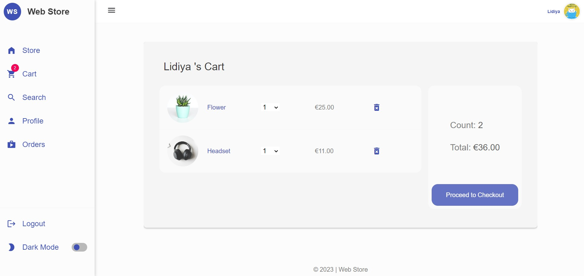
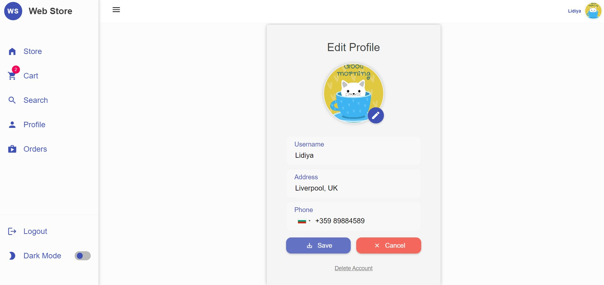
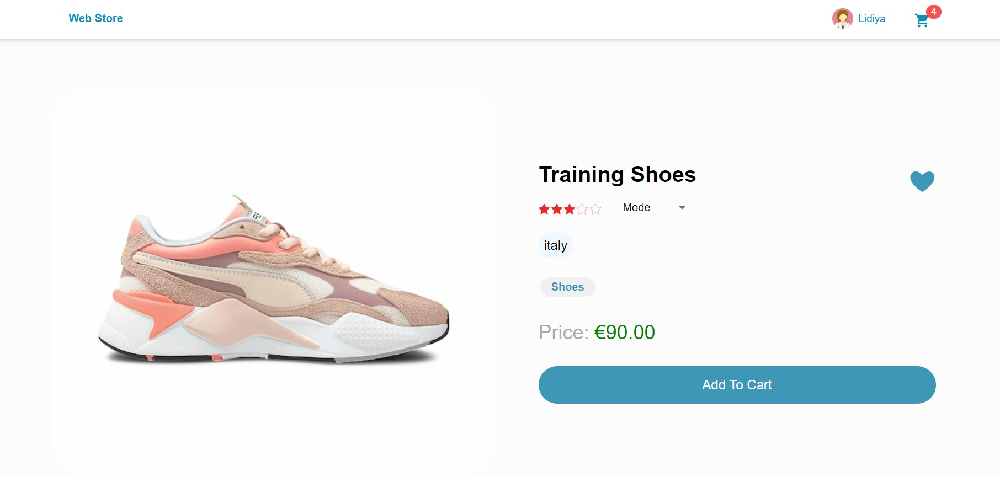
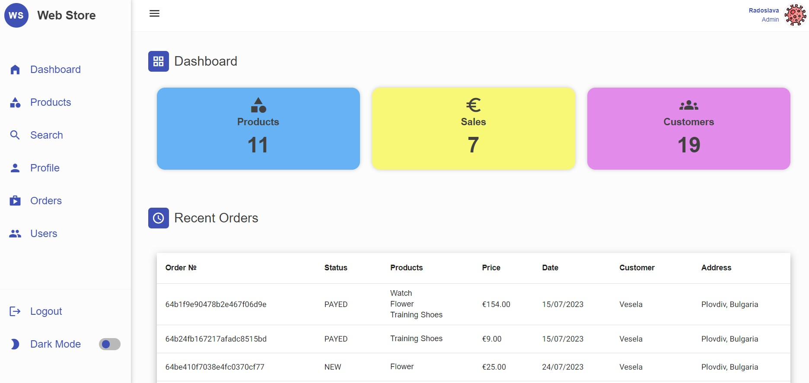
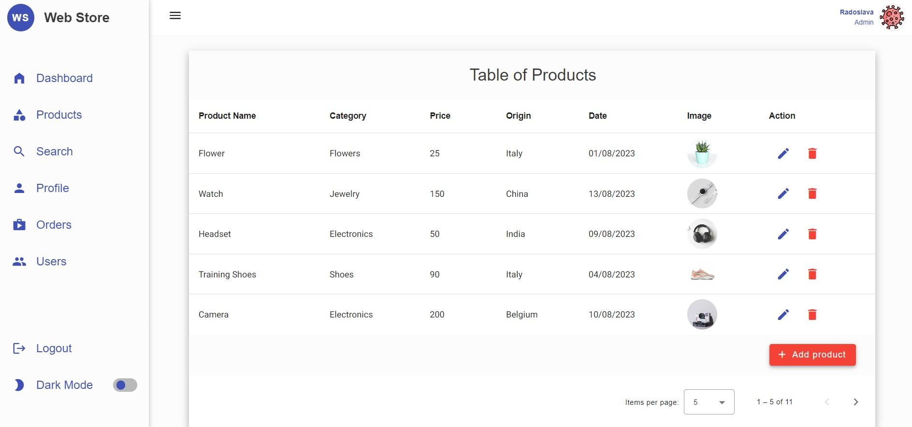
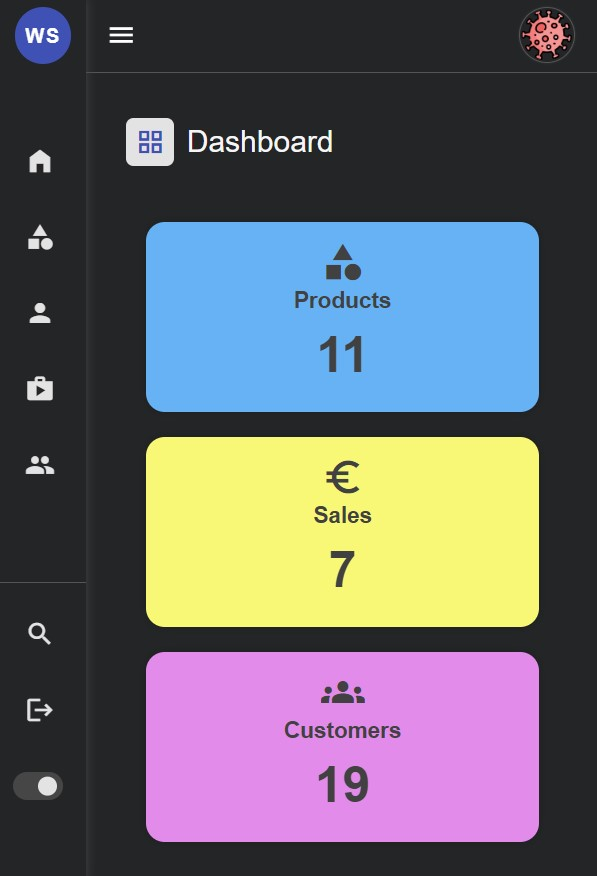
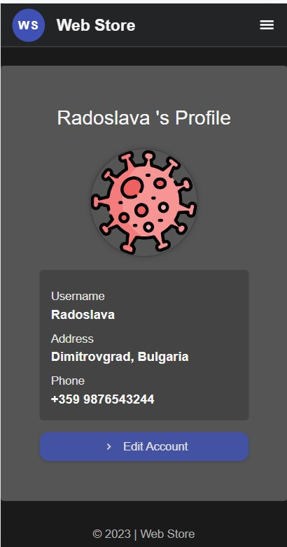
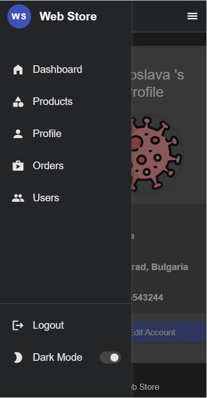

# Web Store - A Web Store Website

 <br/>


**Web Store** is a modern, user-friendly web store that provides a variety of products from different categories. The website is built with the latest technologies, including MEAN Stack and is designed to be accessible to all. 
 <br/>
 <br/>
 This project is a result of my efforts during a 1-month Angular Course. This course has been a valuable learning experience that has prepared me for future projects and opportunities.
 <br/>

> Visit the website: [Web Store Website](https://web-store-85da.onrender.com/)<br/> <br/>


## Table of Contents

1. [Project Status](#1-project-status)
2. [Features](#2-features)
3. [Technologies Used](#3-technologies-used)
4. [Screenshots](#4-screenshots)
5. [Room for Improvement](#5-room-for-improvement)
6. [Setup](#7-setup)

<br/>

## 1. Project Status

Project is: _in progress_ 
The project is currently in progress and actively being developed. I am continuously adding new features and fixing any bugs to ensure a seamless user experience.

This project is the final project of a one-month MEAN Stack course by SoftUni. It has been officially presented in August 2023. 
<br/>

## 2. Features

## Web Store provides several key features to users who prefer shopping from home. 

**For Not Logged In Users:**

- Browse products without the need to log in
- Filter and search products
- View Product Details
- Opportunity to Sign Up
- Use the application in desktop and mobile version
- Switch into Dark Mode 


**For Logged In Users:**

- Browse products and view the product details 
- Mark products as favourite
- Rate a product
- Buy a product
- Paypal payment option
- Mark their location on the map by order checkout
- Monitor made orders and their status
- Manage a user profile, including the ability to provide contact information (phone), add a profile photo and delete profile account
- Ability to reset passwords

**For Admins:**

Admin Dashboard allows special users to:
- Create, View, Edit and Delete Products
- Have overview of all users 
- Track all orders made on Web Store
- Filter, Sort, Paginate data in the Products, Orders and Users Tables
 <br />


## 3. Technologies Used
 Some of the key technologies used in the project include:

**General:**
- Node.js (v16.20.0)
- Package Manager: npm 8.19.4

**Frontend:**
- Angular ( 16.1.4)
- Leaflet (1.9.4) 
- Ngx Toastr (^17.0.2)
- Rxjs (~7.8.0)
- TypeScript (~5.1.3)
- Ng-particles (^3.12.0)


**Backend**
- Express (^4.18.2)
- Mongoose (^7.3.4)
- Bcryptjs (^2.4.3)
- JsonWebToken (^9.0.1)
- Cloudinary (^1.39.0)
- TypeScript (~5.1.6)

**Data base:**
- MongoDB

**Deployment:**
-  Render.com

## 4. Screenshots








<div style="display: flex; justify-content: space-between; gap: 1rem">
  
  
  
</div>


## 6. Room for Improvement

 Improvements for future development to provide better user expierence:

- [ ] Confirmation process during sign-up, which can be enhanced by implementing a confirmation link.
- [ ] Add new feature for reviewing a product
- [ ] Implement cancel order functionality
- [ ] Improve mobile version layout
- [ ]  Expand Admin Dashboard with new functionalities
- [ ] Code optimisation according to best practices

## 7. Setup

To run this project, install it locally using npm:

```
$ git clone git@github.com:dimilidi/web-store.git
$ cd backend
$ npm install
$ npm start
$ cd frontend
$ npm install
$ npm start
```


