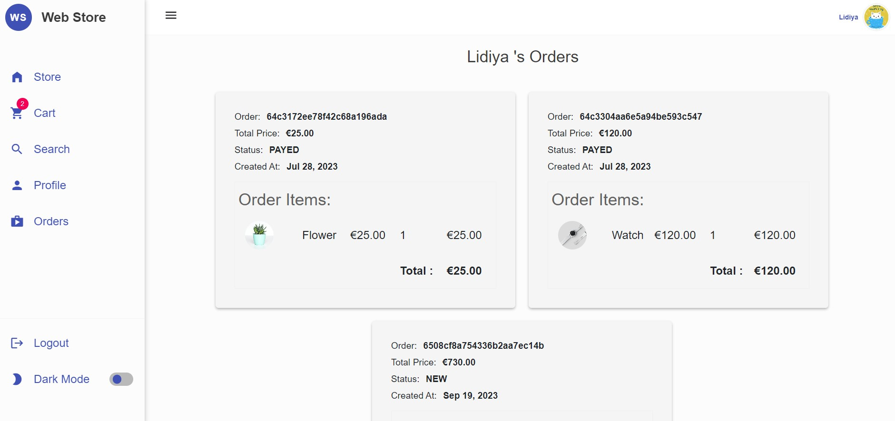
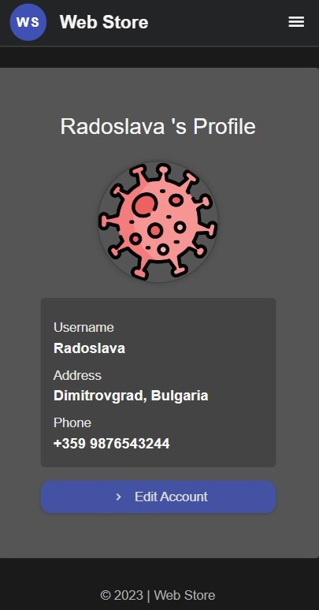
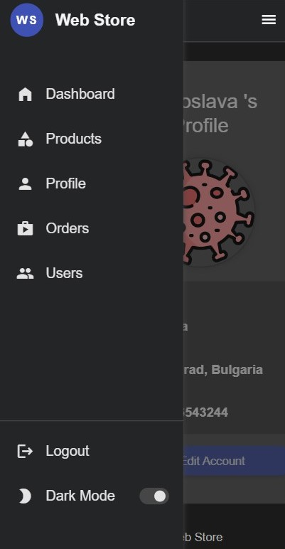

# Web Store - A Web Store Website

**Web Store** is a user-friendly web store that provides a variety of products from different categories. The website is built with the latest technologies, including MEAN Stack and is designed to be accessible to all. 

This project is a result of my efforts during an Angular Course by [SofUni](https://softuni.bg/). This course has been a valuable learning experience that has prepared me for future projects and opportunities.

Visit the website: [Web Store Website](https://web-store-85da.onrender.com/)

## Table of Contents

1. [Project Status](#1-project-status)
2. [Features](#2-features)
3. [Project Structure](#3-project-structure)
4. [Technologies Used](#4-technologies-used)
5. [Screenshots](#5-screenshots)
6. [Room for Improvement](#6-room-for-improvement)
7. [Setup](#7-setup)

## 1. Project Status

Project is: _in progress_ 

The project is currently in progress and actively being developed. I am continuously adding new features and fixing any bugs to ensure a seamless user experience.

## 2. Features

**For Not Logged In Users:**
- Browse products without the need to log in
- Filter and search products
- View Product Details
- Opportunity to Sign Up
- Use the application in desktop and mobile version
- Toggle Dark & Light Mode 

**For Logged In Users:**
- Browse products and view the product details 
- Mark products as favourite
- Rate a product
- Buy a product
- Paypal payment option
- Mark their location on the map by order checkout
- Monitor made orders and their status
- Manage a user profile, including the ability to provide contact information (phone), add a profile photo and delete profile account
- Ability to reset passwords

**For Admins:**
- Create, View, Edit and Delete Products
- Have overview of all users 
- Track all orders made on Web Store
- Filter, Sort, Paginate data in the Products, Orders and Users Tables

## 3. Project Structure

The Angular project follows the MVC (Model-View-Controller) architecture.  

### Main folders and files in the project:

- **src**
  - **app**
  - **assets**: Contains static files such as images, fonts, and other resources.
  - **environments**
  - **index.html**: Serves as the entry point to the application.
  - **main.ts**: Responsible for initializing the Angular framework, loading the root module of the application, and starting the application runtime.
  - **style.css**: Global styles are defined.
  - **typings.d.ts**: Responsible for declaring type definitions or type declarations.

- **app**
  - **auth**: Contains admin and authentication guards, as well as an authentication interceptor. 
  - **components**: Represents different parts of the user interface in components. All components consist of a TypeScript class, an HTML template, and optional CSS styles.  
  Bigger components that are representing pages of the app are stored in pages folder. Smaller reusable components are placed in partials folder.     
  The pages are seperated according there usage. Pages used in dashboard part oft he app are located in dashboard-pages folder. Pages used in web store – in store-pages. There are also common-pages shared from both main parts of the app. 

  - **directives**: Contains the `IntlTelInputDirective`, a custom attribute directive used to handle international telephone input in forms.
  - **services**: Contains all services in the app, providing functionality that can be shared across multiple components by injecting dependencies in the components' constructors.
  - **shared**: Contains code used in all parts of the app.
  - **app-component**: The `appComponent` serves as the main component of our application.
  - **app-routing.module.ts**: The `AppRoutingModule` is responsible for managing navigation and routing within the application.
  - **app-module.ts**: The `AppModule` is the core module of the Angular application.

- **angular.json**: The Angular configuration file where various aspects of the project are configured.

## 4. Technologies Used
Some of the key technologies used in the project include:

**General:**
- Node.js (v16.20.0)
- Package Manager: npm 8.19.4

**Frontend:**
- Angular (16.1.4)
- Leaflet (1.9.4) 
- Ngx Toastr (^17.0.2)
- Rxjs (~7.8.0)
- TypeScript (~5.1.3)
- Ng-particles (^3.12.0)

**Backend:**
- Express (^4.18.2)
- Mongoose (^7.3.4)
- Bcryptjs (^2.4.3)
- JsonWebToken (^9.0.1)
- Cloudinary (^1.39.0)
- TypeScript (~5.1.6)

**Database:**
- MongoDB

**Deployment:**
- Render.com

## 5. Screenshots





<div style="display: flex; justify-content: flex-start;">
  
  
  
</div>

## 6. Room for Improvement

Improvements for future development to provide better user experience:

- [ ] Confirmation process during sign-up, which can be enhanced by implementing a confirmation link.
- [ ] Add new feature for reviewing a product
- [ ] Implement product lazy loading or home page pagination
- [ ] Implement cancel order functionality
- [ ] Expand Admin Dashboard with new functionalities
- [ ] Code optimization according to best practices

## 7. Setup

To run this project, install it locally using npm:

```
$ git clone git@github.com:dimilidi/web-store.git
$ cd backend
$ npm install
$ npm start
$ cd frontend
$ npm install
$ npm start
```
